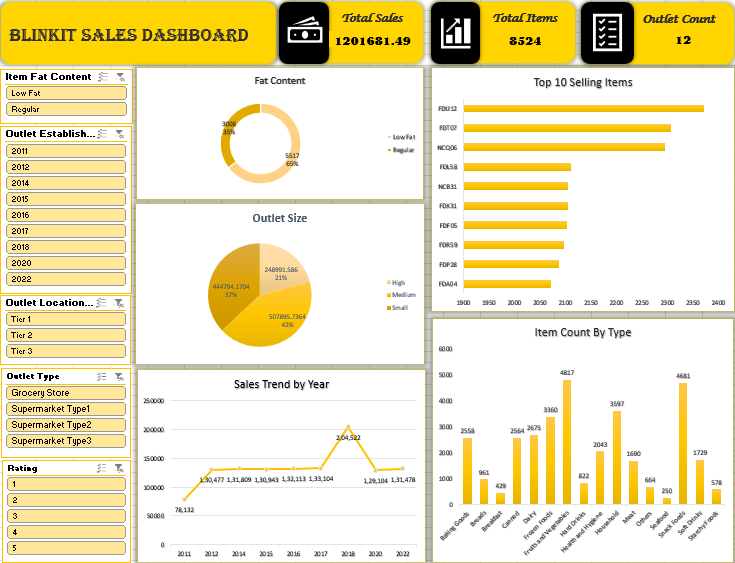

# 🟡 Blinkit Sales Dashboard (Excel Project)

### 📈 Project Overview

This project analyzes Blinkit’s grocery sales data to uncover insights into product performance, outlet trends, and overall business growth using **Microsoft Excel**.
It demonstrates how Excel can be used as a powerful BI tool to clean data, analyze KPIs, and design interactive dashboards.

---

### 🧹 Data Cleaning

Performed in **Power Query**:

* Filled missing `Item_Weight` values using item-level and category-level averages.
* Removed duplicates and verified data consistency.

---

### 🧮 KPIs

* **Total Sales:** 1,201,681.49
* **Total Items:** 8,524
* **Outlet Count:** 12

---

### 🎨 Dashboard Features

* Interactive slicers for `Item_Type`, `Outlet_Size`, `Outlet_Type`, and `Fat_Content`
* Clean Blinkit-themed design (Yellow & Black)
* Dynamic Top 10 charts and year-wise trends

---

### 🧰 Tools Used

* **Excel (Power Query, Pivot Tables, Slicers, Charts)**

---

### 📷 Dashboard Preview

---

### 🚀 How to Use

1. Download the `.xlsx` file.
2. Enable macros (if prompted).
3. Use slicers to explore item and outlet performance.
4. Filter by year, outlet type, or size to see dynamic updates.

---

### 📁 Dataset

Dataset Source: [Blinkit Grocery Dataset on Kaggle](https://www.kaggle.com/datasets/arunkumaroraon/blinkit-grocery-dataset)

---

### 💡 Insights

* **Regular fat content items** drive ~69% of total sales.
* **Medium-sized outlets** generate the highest sales share (42%).
* Sales peaked in **2018**, followed by a steady trend.
* Top-performing products are consistent across multiple outlets.

---

### ✨ Author

**Dona C**
📍 M.Sc. Computer Science | Data Analyst | Excel & Power BI Enthusiast
🔗 [LinkedIn](https://www.linkedin.com/in/dona-c/) | [GitHub](https://github.com/DonaChristy)
